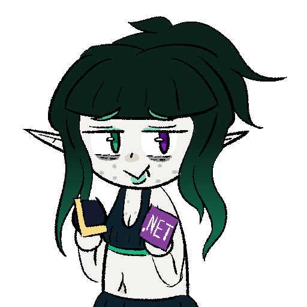

# GrrrLCU

[](https://www.nuget.org/packages/BlossomiShymae.GrrrLCU/) [](https://www.nuget.org/packages/BlossomiShymae.GrrrLCU/)



GrrrLCU is a wrapper for the LCU API which is unofficially provided by Riot Games.

This library is currently compatible with .NET 8 and higher for Windows.

## Contributors

<a href="https://github.com/BlossomiShymae/GrrrLCU/graphs/contributors">
  
</a>

## Usage

### Sample application

[A demonstration of GrrrLCU with more code examples can be found here.](https://github.com/BlossomiShymae/GrrrLCU/blob/main/BlossomiShymae.GrrrLCU.Demo/Program.cs)

To run the demo:
```bash
dotnet run --project BlossomiShymae.GrrrLCU.Demo
```

### Requesting the LCU

This library uses the `System.Net.Http.HttpClient` interface via `LcuHttpClient`. It comes with a built-in handler that takes care of the request path and authorization header.

> [!NOTE]
> The built-in handler will attempt to refresh the port and auth if a `HttpRequestException` is encountered **on request**. `InvalidOperationException` will be thrown if the port of the current LCU process cannot be found or the port cannot be connected to.


#### Getting the LcuHttpClient instance

```csharp
var client = Connector.GetLcuHttpClientInstance();
```

#### General request

```csharp
var response = await client.SendAsync(new(HttpMethod.Get, "/lol-summoner/v1/current-summoner"));

var me = await response.Content.ReadFromJsonAsync<Summoner>();
```

#### GET request

```csharp
var me = await client.GetFromJsonAsync<Summoner>("/lol-summoner/v1/current-summoner");
```

#### POST request with JSON body

```csharp
var response = await client.PostAsJsonAsync("/player-notifications/v1/notifications", playerNotificationResource);

var resource = await response.Content.ReadFromJsonAsync<PlayerNotificationResource>();
```

> [!WARNING]
> `ProcessFinder.IsActive()` does not necessarily mean that the LCU process port is open for requests. Use `ProcessFinder.IsPortOpen()` instead.

#### Utilities

```csharp
var leagueClientProcess = ProcessFinder.GetProcess();
var processInfo = ProcessFinder.GetProcessInfo();
var isActive = ProcessFinder.IsActive();
var isPortOpen = ProcessFinder.IsPortOpen();

var riotAuthentication = new RiotAuthentication(processInfo.RemotingAuthToken);
```

### WebSockets

This library uses the `Websocket.Client` wrapper.

Create a client:

```csharp
var client = Connector.CreateLcuWebsocketClient();
```

Listen to events, disconnections, or reconnection messages:

```csharp
using System; // Include to avoid compiler errors CS1503, CS1660.
              // You may or may not need this.

client.EventReceived.Subscribe(msg =>
{
    Console.WriteLine(msg?.Data?.Uri);
});
client.DisconnectionHappened.Subscribe(msg => 
{
    if (msg.Exception != null) throw msg.Exception;
});
client.ReconnectionHappened.Subscribe(msg =>
{
    Console.WriteLine(msg.Type);
});
```

Use it:

```csharp
// This starts the client in a background thread. You will need an event loop
// to listen to messages.
await client.Start();

// Subscribe to every event that the League Client sends.
var message = new EventMessage(EventRequestType.Subscribe, EventKinds.OnJsonApiEvent);
client.Send(message);

// We will need an event loop for the background thread to process.
while(true) await Task.Delay(TimeSpan.FromSeconds(1));
```

Whenever a public application is made with GrrrLCU, graceful reconnection is needed as the end-user may restart, exit, or open the League client. The built-in reconnection handler will not be enough for this case.

An example pattern using threads is provided to show how reconnection can be done.

```csharp
public class ExampleViewModel
{
	public WebsocketClient? Client { get; set; }

	public ExampleViewModel()
	{
		new Thread(InitializeWebsocket) { IsBackground = true }.Start();
	}

	private void InitializeWebsocket()
	{
		while (true)
		{
			try
			{
				var client = Connector.CreateLcuWebsocketClient();
				client.DisconnectionHappened.Subscribe(OnDisconnection);

				client.Start();
				client.Send(new EventMessage(EventRequestType.Subscribe, EventKinds.OnJsonApiEvent));
				Client = client;
				return;
			}
			catch (Exception) { }
			Thread.Sleep(TimeSpan.FromSeconds(5));
		}
	}

	private void OnDisconnection(DisconnectionInfo info)
	{
		Client?.Dispose();
		new Thread(InitializeWebsocket) { IsBackground = true }.Start();
	}
}
```